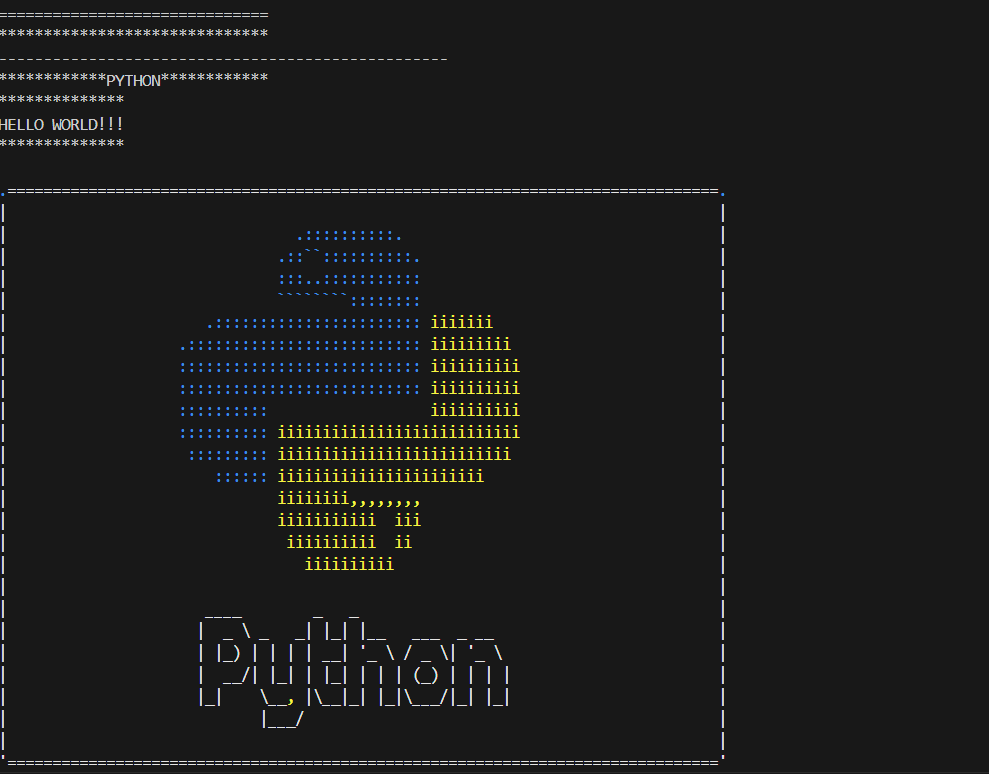

# cli_utils

A beginner-friendly Python package with CLI utility functions.

## Usage

```
from cli_utils import (
    print_separator,
    print_char_separator,
    print_custom_separator,
    print_labeled_separator,
    print_box,
    color_art,
)

print_char_separator("=")

print_separator()

print_custom_separator('.', 50)

print_labeled_separator("PYTHON")

print_box("HELLO WORLD!!!")

color_art()
```
## Output: 




